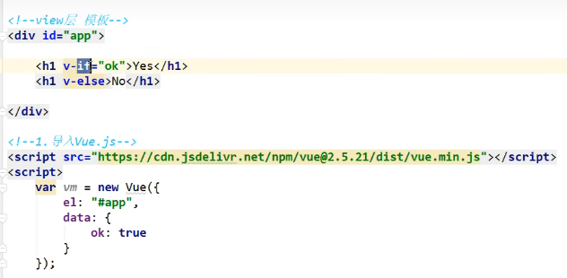
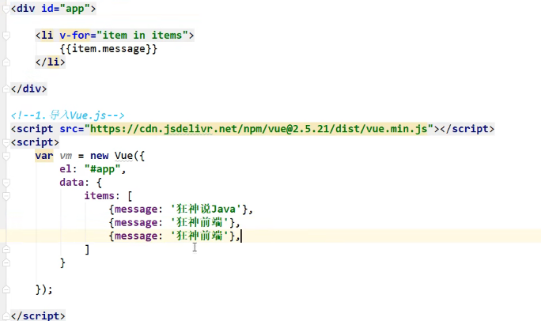

### Vue3开发指南

在Vue3中，项目的启动和起步模板与Vue2有所不同。Vue3使用`npm run dev`启动项目，而Vue2使用`npm run serve`。Vue组件由模板、功能和样式表组成，重要的是理解双向绑定的概念。

双向绑定意味着数据变化会自动更新视图，视图变化也会自动更新数据。在Vue中，数据是响应式的，通过el表达式将数据绑定起来，实现数据与视图的双向绑定。这种关系称为View-Model（视图模型）。在传统的JavaScript开发中，我们需要手动操作DOM节点，而在Vue中，我们可以直接修改`data`中的数据，Vue会自动更新DOM节点，这个过程被称为虚拟DOM。


### Vue语法学习

1. **v-bind单向绑定**

   使用`v-bind`可以实现数据绑定，将data属性绑定到HTML元素的属性上。例如，给`span`的`title`属性绑定一个动态提示信息：

    ```html
    <span v-bind:title="message">悬浮提示</span>
    ```

   

   这样可以动态地将`message`的数据绑定到`title`属性上。

2. **v-if**

   `v-if`指令用于条件渲染，可以根据`data`中的布尔值来控制元素的显示或隐藏：

    ```html
    <div v-if="isShow">显示内容</div>
    <div v-else>隐藏内容</div>
    ```

   
   

   根据`isShow`的值来决定显示哪一个`div`。

3. **v-for**

   `v-for`指令用于循环渲染列表数据，与Java中的增强for循环类似：

    ```html
    <ul>
      <li v-for="item in items">{{ item }}</li>
    </ul>
    ```

   

   这里循环遍历`items`列表，并将每个`item`渲染到`li`元素中。

4. **v-on**

   `v-on`指令用于绑定事件监听器，例如点击、双击或键盘事件：

    ```html
    <button v-on:click="sayHi">点击我</button>
    ```

   

   绑定点击事件，触发`sayHi`方法。

5. **v-model双向绑定**

   `v-model`指令用于实现双向绑定，可以同步数据和DOM节点的值：

    ```html
    <input v-model="message" placeholder="输入内容">
    ```

   

   输入框的值与`message`数据绑定，实现双向数据绑定。

   

6. **mounted钩子函数**

   钩子函数在Vue实例的生命周期中自动调用，例如初始化、更新数据或销毁时：

    ```javascript
    mounted() {
      console.log('组件已挂载');
    }
    ```

   

### 组件

Vue组件可以嵌套，形成父子关系。父组件可以包含子组件，子组件通过`props`接受参数：

```html
<template>
  <div>
    <ChildComponent v-bind:propMessage="parentMessage"></ChildComponent>
  </div>
</template>

<script>
import ChildComponent from './ChildComponent.vue';

export default {
  components: {
    ChildComponent
  },
  data() {
    return {
      parentMessage: '来自父组件的消息'
    };
  }
};
</script>
```

子组件`ChildComponent`使用`props`接收父组件传递的`parentMessage`：

```html
<template>
  <div>{{ propMessage }}</div>
</template>

<script>
export default {
  props: ['propMessage']
};
</script>
```


关注几个组件的嵌套关系，头部组件可以理解为APP，下面是几个component，Component中又有几个组件，每个组件通过自身的style样式限制其它组件的展示。

一个组件实际上就是一个自定义标签，在其它的组件中使用的就是这个自定义标签，这个标签中有一些功能语法。现在推测`export`应该就是控制标签的导出名字。


这里应该是在v-for语句中定义了一个item变量，然后使用v-bind将这个变量和props中的参数列表进行双向绑定。组件接受参数都使用props，props中可以定义一个参数列表，在组件中使用props中的参数列表。

### 总结

通过理解Vue的双向绑定、指令（如`v-bind`、`v-if`、`v-for`、`v-on`、`v-model`）和生命周期钩子函数，可以更有效地进行Vue3开发。同时，组件化开发使代码结构更加清晰和可维护。