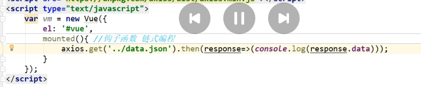
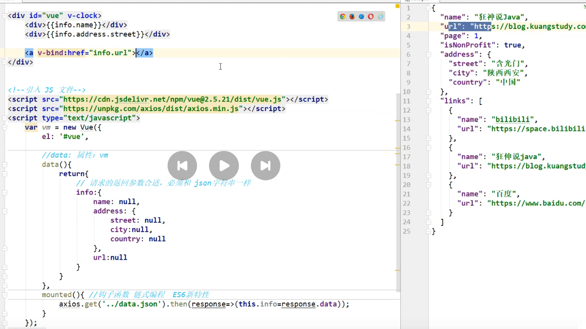
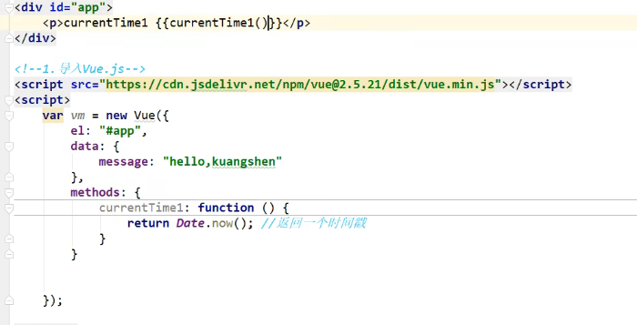
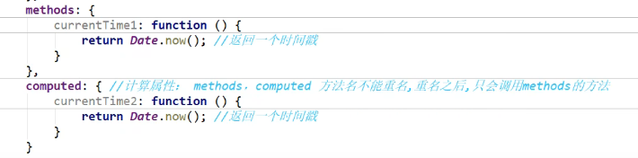
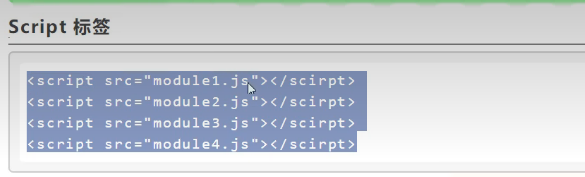
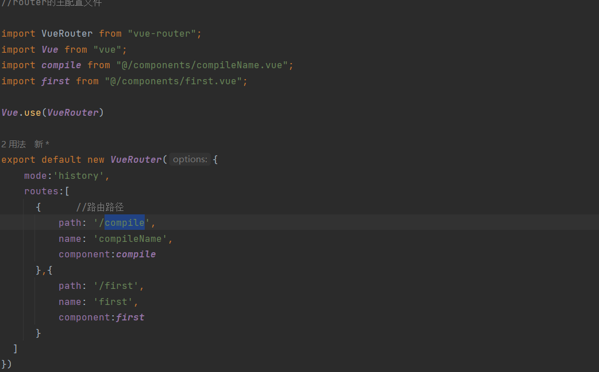

#### axios 网络通信 jQuery.ajax()
Axios 主要作用是用于实现AJAX异步通信

axios通过get（url）获得response，然后再then函数种做了一个打印方法
这里的mounted钩子函数用于确定在vue的哪个生命周期的位置挂在这个函数
    mounted函数指的是在组件挂载之前操作函数

计算属性，计算出来的结果保存在属性中，在内存中运行

在currentTime1中定义了一个获得时间的方法
在模板中通过currentTime()的方式调用了这个方法

计算方法和methods方法的区别
计算方法得到的是一个属性，而method方法是一个函数，当数据被刷新后重新计算
不经常变化但是会变化的内容用计算属性保存

### 插槽 slot
在一个页面中留出一个空间用于动态的显示内容，实现内容的复用

### 自定义内容分发

### Vue-cli脚手架

### Webpack
webpack本质上是一个静态模块打包器
后端使用package.json，在前端由webpack打包
这是原始的引入js代码的方式

这种原始的加载方式有一些显而易见的弊端
全局作用域下容易造成变量冲突
文件只能按照<script>的书写顺序加载
开发人员必须解决模块和代码的依赖关系

为了解决这些问题，服务器端的nodeJS村寻CommonsJS规范，该规范允许模块通过require方法来同步加载所需依赖的其他模块，燃火通过exports或者module.exports来导出需要暴露的接口
在vue上就是在一个组件中把内容暴露，然后再在另一个组件中引入，这样就避免了代码冲突

webpack用于将es6规范打包为es5规范

### Vue-router

理解一下，在vue中程序的主入口是main.js，它实际上是一个带js的html页面，在这里面引入了一个叫做router的js插件，这个插件的使用方式是在外部提供一个
键值对的配置文件，在页面中就是main.js中就可以根据键值对来访问页面,我推测<router-view>也应该是一个组件，有可能类似插槽。

main.js还干了另外一件事，就是初始化app页面，初始化一个app.vue组件，然后渲染这个组件中的内容
大概应该是这种架构
main.js =》 app.vue =》 router.js =》 页面

<router-view>存放的是router的根节点

### Element-UI
安装sass用于辅助css编译

